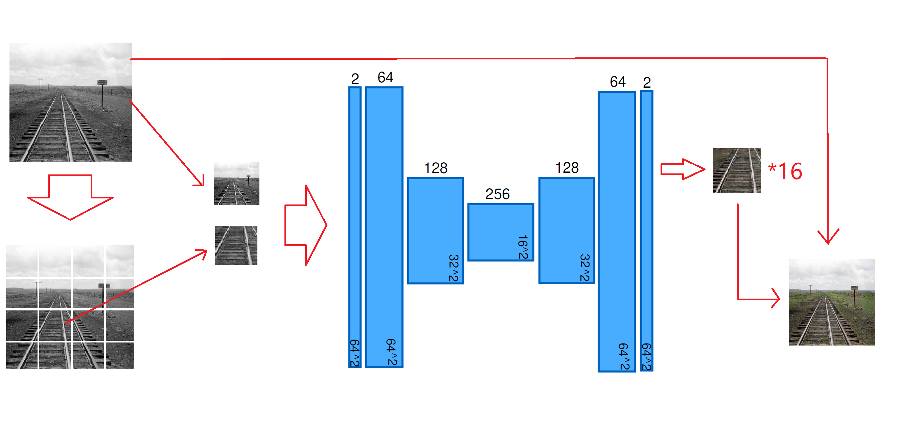
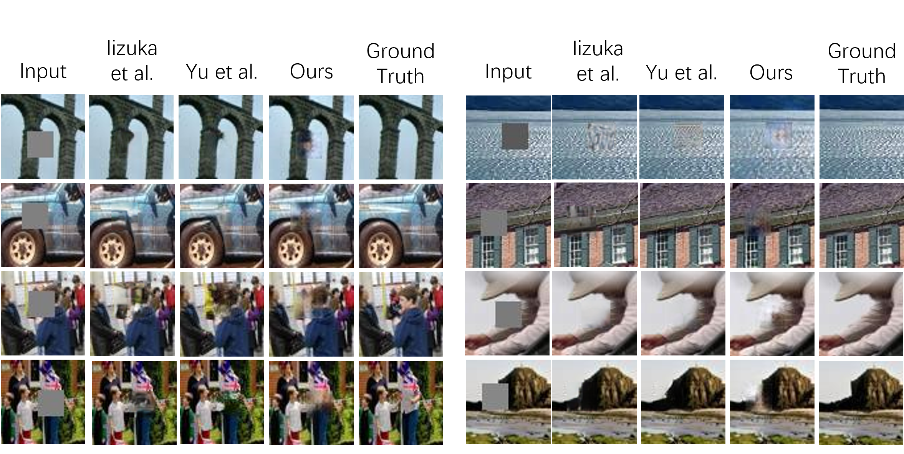

# COMP4471: Deep Learning in Computer Vision

**Insturctor: Prof. CHEN, Qifeng**

*A large part of this course is modeled according to CS231n offered at the Stanford University.*

## Programming Assignment

### PA1:
1. KNN
2. SVM
3. Softmax
4. Two-Layer Nerual Network
5. Higher Level Representations
(100/100)

### PA2:
1. Fully-conneccted Neural Network
2. Batch Normalization
3. Dropout
4. Convolutional Networks
5. PyTorch / TensorFlow on CIFAR-10
(100/100)

### PA3:
1. Image Captioning with Vanilla RNNs
2. Image Captioning with LSTMs
3. Network Visualization: Saliency maps, Class Visualization, Fooling Images
4. Style Transfer
5. Generative Adversarial Networks
(100/100)

## Course Project

[report](./project/report.pdf)

### Abstract
*Image synthesis has been an active research area in computer
vision. Many existing models can generate plausible
and high-quality results in different generation tasks. However,
these models are usually task-specific and computationally
expansive, requiring large datasets and excessive
effort to train. For many developers with limited resources,
a simpler model that requires a smaller dataset and less
computational cost is preferred. We tried to construct a simple
network combining GAN and U-net that is applicable to
different generation tasks without imposing training overhead
or modifying the original network structures. To validate
our network performance, we evaluated it qualitatively
on two image synthesis tasks including image colorization
and image inpainting.*

### Show

